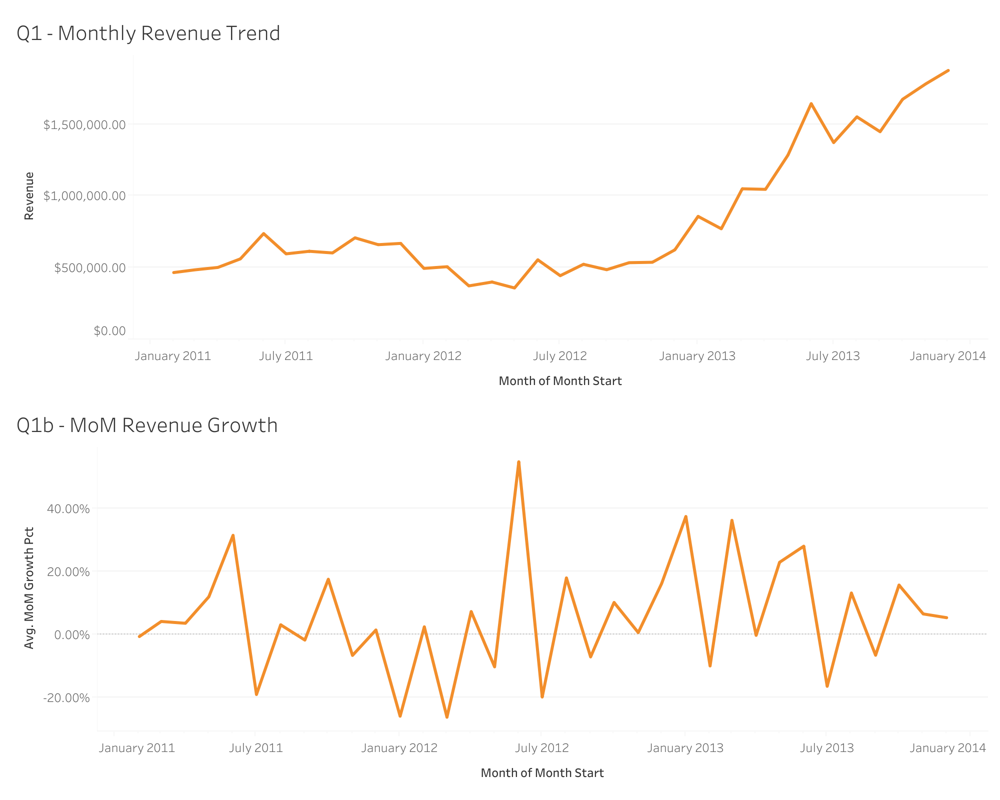
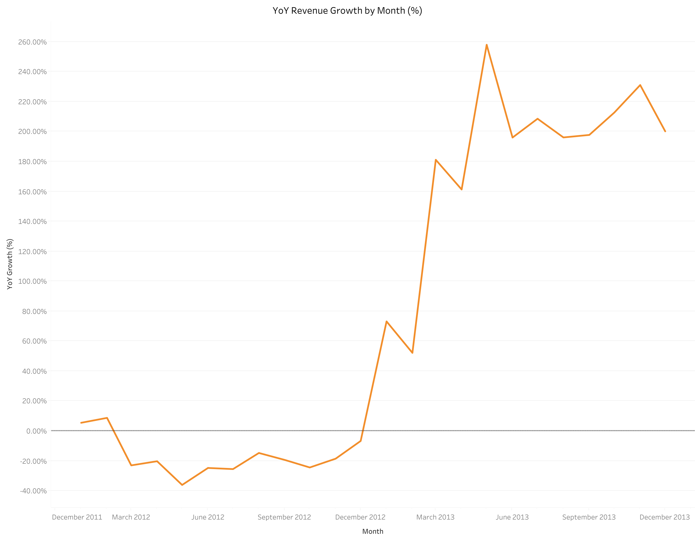
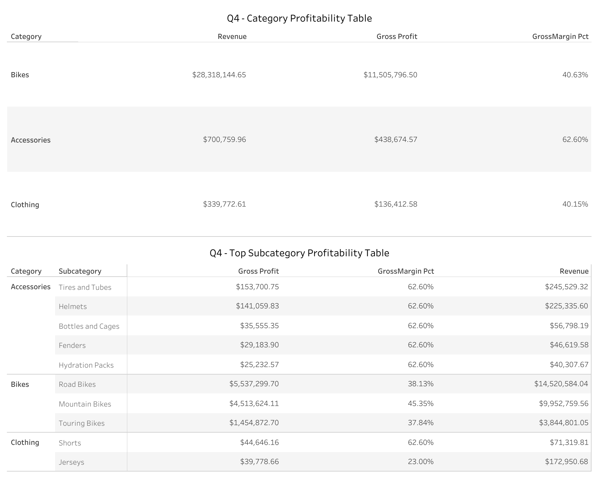
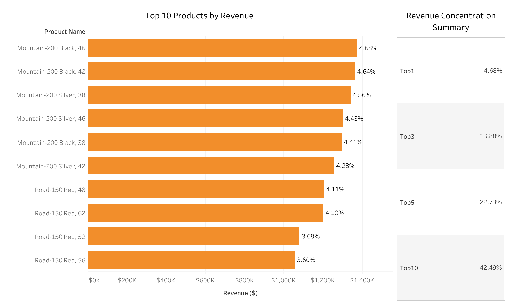
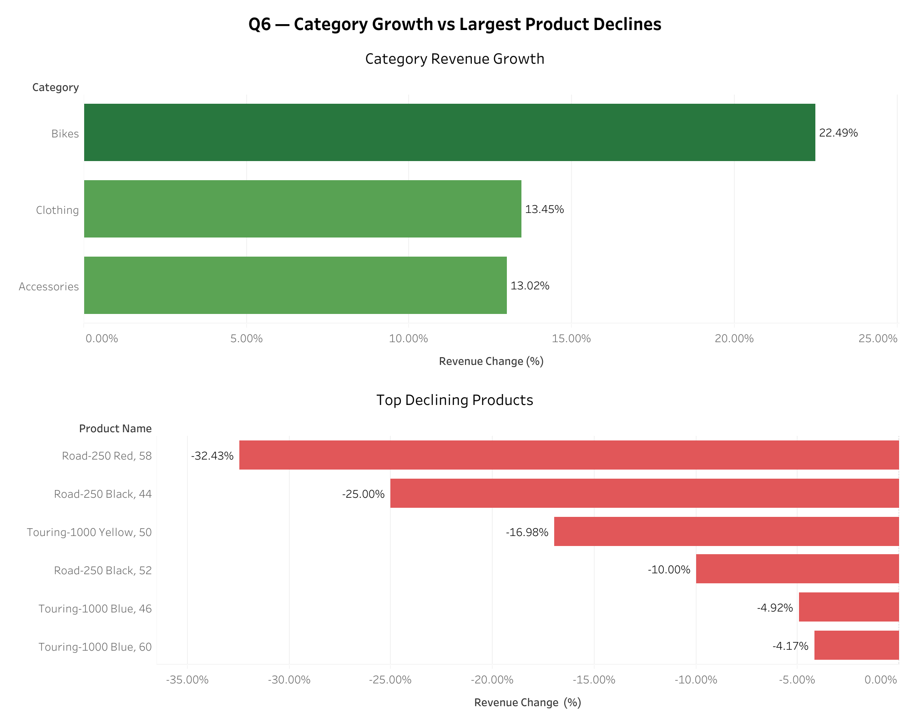
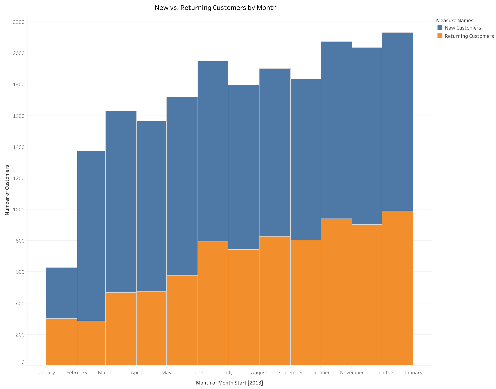
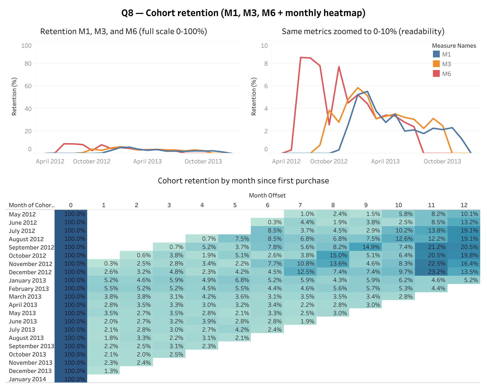
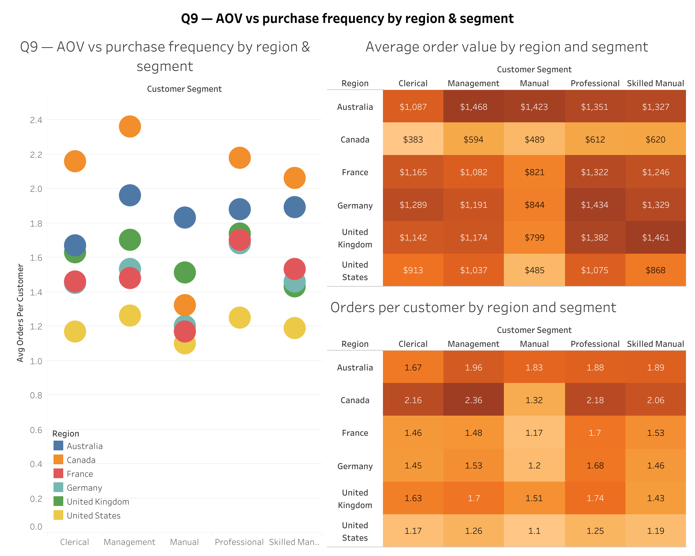
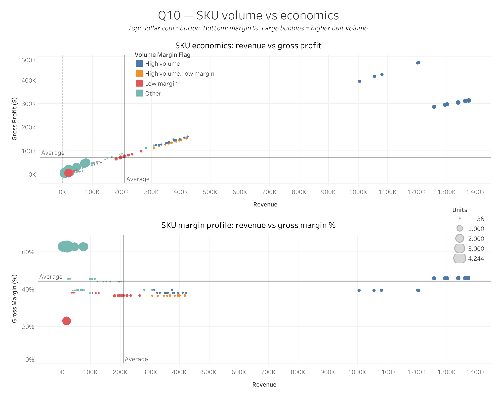

# Business Analysis: SQL + Tableau

End-to-end business analysis project using SQL (Microsoft SQL Server) and Tableau. Covers 10 analytical questions across revenue, profitability, customer retention, and product economics — the kind of analysis run weekly in FP&A and operations roles.

**Live Tableau Dashboards:** [View on Tableau Public](https://10ay.online.tableau.com/#/site/aurk-186dea8097/projects/2162785)

---

## Dataset

**AdventureWorks** — Microsoft's open sample database simulating a bicycle manufacturer's sales operations. Includes internet sales transactions, product catalog, customer demographics, and geography data spanning 2011–2014.

---

## Questions & Visuals

### Q1 — Monthly Revenue Trend & MoM Growth
How has revenue changed over time, and what is the month-over-month growth rate?

Techniques: `CTE`, `LAG()` window function, boundary trimming

---

### Q2 — Year-over-Year Revenue Growth
What are the YoY growth rates by month — seasonality-adjusted and more meaningful than MoM alone.

Techniques: `LAG(Revenue, 12)` for same-month prior year comparison

---

### Q3 — Revenue Contribution by Country
Which countries generate the most revenue, and what share of total does each contribute?

Techniques: `SUM() OVER ()` for percentage of total, `DENSE_RANK()`

---

### Q4 — Category & Subcategory Profitability
Which product categories and subcategories drive the highest revenue and gross profit?

Techniques: Multi-table `JOIN`, gross margin calculation, window-based share of total

---

### Q5 — Top 10 Products by Revenue + Concentration Risk
What are the top 10 products, and how concentrated is revenue across the catalog?

Techniques: `ROW_NUMBER()`, running cumulative share with `SUM() OVER (ORDER BY ...)`, `CROSS JOIN` for totals

---

### Q6 — Category Growth vs. Declining Products
Which categories are growing and which individual products are declining in recent months?

Techniques: Rolling 3-month window comparison (Recent3 vs Prior3), `CROSS JOIN VALUES`, `COALESCE` for zero-fill

---

### Q7 — New vs. Returning Customers by Month
How many new vs. returning customers are active each month?

Techniques: First-purchase CTE, conditional `COUNT(DISTINCT ...)`, retention share %

---

### Q8 — Cohort Retention Analysis (M1, M3, M6 + Heatmap)
What is the customer retention rate at 1, 3, and 6 months post-acquisition, by cohort?

Techniques: Cohort construction, `DATEADD` offset matching, `DATEDIFF` for heatmap offsets, retention % by cohort size

---

### Q9 — AOV & Purchase Frequency by Region and Segment
How do average order value and purchase frequency differ across regions and customer segments?

Techniques: Multi-dimension aggregation, `LEFT JOIN` on geography, segment cross-analysis

---

### Q10 — SKU Volume vs. Margin Economics
Which products sell at high volume but contribute relatively little gross profit?

Techniques: `NTILE(4)` quartile scoring, volume/margin quadrant flagging, `CASE` classification

---

## SQL Techniques Used

| Technique | Used In |
|---|---|
| CTEs (Common Table Expressions) | All queries |
| Window functions (LAG, RANK, NTILE, SUM OVER) | Q1, Q2, Q3, Q5, Q10 |
| Cohort analysis | Q7, Q8 |
| Rolling period comparison | Q6 |
| Multi-table JOINs | Q3, Q4, Q6, Q7, Q8, Q9 |
| Conditional aggregation (CASE WHEN inside SUM) | Q5, Q6, Q7, Q8 |
| Running totals / cumulative share | Q5 |
| NTILE quartile scoring | Q10 |

---

## Tools

- **SQL:** Microsoft SQL Server (T-SQL) — all queries in `analysis_queries.sql`
- **Visualization:** Tableau — dashboards published at the link above
- **Dataset:** AdventureWorks (open Microsoft sample data)

---

## How to Run

1. Install the AdventureWorks database on Microsoft SQL Server ([download here](https://learn.microsoft.com/en-us/sql/samples/adventureworks-install-configure))
2. Open `analysis_queries.sql` in SQL Server Management Studio (SSMS) or Azure Data Studio
3. Run queries individually — each is clearly labeled with its question number and purpose
